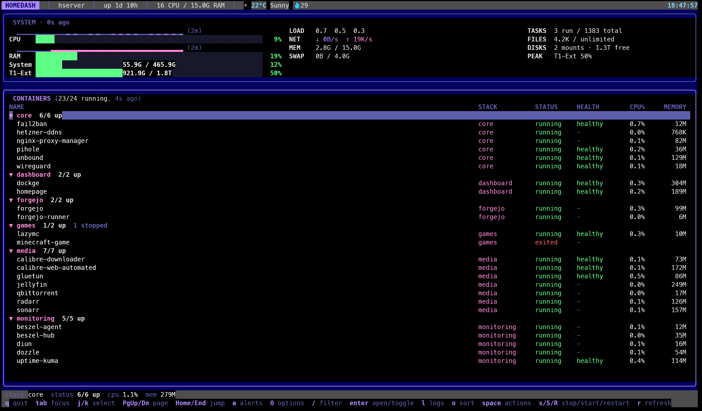
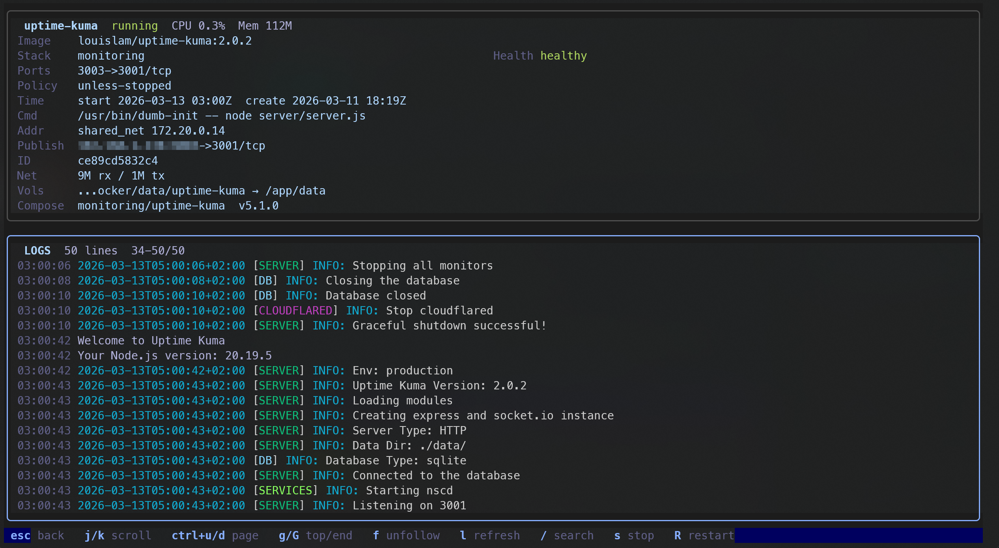
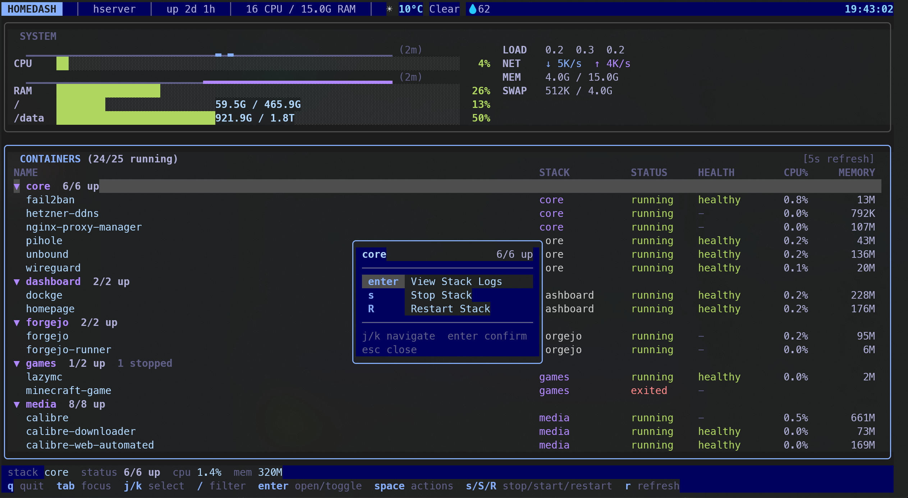

# HomeDash

[](https://github.com/kts982/Homedash/actions/workflows/ci.yml)
[](https://go.dev)
[](LICENSE)

A terminal dashboard for single-host Linux homelabs.

HomeDash combines host metrics, Docker Compose stacks, stack summaries, container and stack logs, and common stack or container actions in one TUI. It is built for people running a personal server who want one operational view instead of jumping between `docker ps`, `docker logs`, `htop`, and ad-hoc scripts.

It reads system data from `/proc`, talks directly to the Docker socket, and optionally fetches weather from [wttr.in](https://wttr.in).

> Status: early-stage, Linux-only, source install for now.

## Who It's For

- people running a personal or home Linux server
- Docker Compose users who think in stacks more than raw Docker objects
- users who prefer terminal workflows over web dashboards

## Non-Goals

- replacing `lazydocker` as a general Docker admin console
- managing clusters, Kubernetes, or multi-host fleets
- being a generic monitoring platform

## Screenshots

### Dashboard Overview



Full-width system panel with CPU/RAM sparklines, gauges with disk usage detail, and container state in one view. Weather conditions shown in the header bar.

### Container Detail And Actions

<p>


</p>

Full-screen container and stack logs, detail metadata, and quick actions without leaving the TUI.

## Features

- **Unified homelab view** - host metrics, Docker containers, and quick actions in one terminal UI
- **Compose-stack grouping and summaries** - containers grouped by `com.docker.compose.project`, with collapsible stacks, health counts, and aggregate stack status
- **Container and stack detail views** - full-screen log viewers with default follow mode on entry, merged stack logs, published port hints, mounts, and start/stop/restart actions
- **Log search and navigation** - `/` in detail views highlights matches across logs, with `n`/`N` to cycle through them
- **Quick-action menu** - `space` opens fast stack or container actions, including stack logs, without leaving the dashboard
- **System metrics** - full-width two-column panel with CPU/RAM sparklines, gauges with disk usage/capacity detail, load averages, network I/O, swap, and uptime
- **Container search** - filter dashboard containers by name with `/`
- **Deterministic test mode** - `--test-mode` flag for developers to run the TUI with synthetic data and frozen UI elements for stable testing and screenshots (internal helper)
- **Focus-aware refresh** - background polling pauses automatically when the terminal loses focus on the dashboard, and resumes with an immediate refresh on refocus; detail/log views stay live regardless
- **Notifications** - Docker state changes, disk warnings, and weather errors
- **Weather** - current conditions via [wttr.in](https://wttr.in), shown in the header bar with responsive degradation
- **Responsive layout** - works across narrow and wide terminals
- **State persistence** - collapsed stack groups are remembered across sessions at `~/.config/homedash/state.json`
- **Themes and mouse support** - Tokyo Night, Catppuccin, Dracula, plus click and scroll navigation

## Status

HomeDash is early-stage, but usable for day-to-day homelab monitoring and container operations.

Current scope:

- Linux only
- single host only
- Docker and Docker Compose focused
- source install first

Expect ongoing UI and feature changes while the project settles.

## Roadmap

Near term:

- packaging and release improvements

Not planned:

- Kubernetes support
- multi-host orchestration
- generic Docker object management beyond the homelab workflow

## Install

### From source

Requires [Go 1.25+](https://go.dev/dl/) and Linux.

```bash
git clone https://github.com/kts982/Homedash.git
cd Homedash
make build
./homedash
```

### Development

Run the local checks before pushing:

```bash
go test ./...
make lint
```

### Requirements

- **Linux** (reads from `/proc`)
- **Docker socket** accessible at `/var/run/docker.sock` (no sudo needed if your user is in the `docker` group)
- **Optional**: Internet access for weather via [wttr.in](https://wttr.in)

## Configuration

HomeDash uses a YAML config file at `~/.config/homedash/config.yaml`. All fields are optional — sensible defaults are used when omitted. Unknown fields are rejected to catch typos.

See [`config.example.yaml`](config.example.yaml) for a full annotated example.

### Config Reference

| Field | Type | Default | Description |
|-------|------|---------|-------------|
| `theme` | string | `tokyo-night` | Color theme: `tokyo-night`, `catppuccin`, `dracula` |
| `system.disks` | list | `[{path: "/"}]` | Disk mount points to monitor |
| `system.disks[].path` | string | required | Absolute path to mount point |
| `system.disks[].label` | string | same as path | Display label |
| `refresh.system` | duration | `2s` | System metrics refresh interval (min: `1s`) |
| `refresh.docker` | duration | `5s` | Docker stats refresh interval (min: `3s`) |
| `refresh.weather` | duration | `5m` | Weather refresh interval (min: `1m`) |
| `docker.host` | string | `unix:///var/run/docker.sock` | Docker daemon socket |

The Docker host can also be set via the `DOCKER_HOST` environment variable, which takes precedence over the config file.

### State Persistence

HomeDash saves UI state (collapsed stack groups) to `~/.config/homedash/state.json`. This file is managed automatically and does not need manual editing. The state path is not configurable.

### Minimal Config

```yaml
# Just override what you need
theme: dracula
system:
  disks:
    - path: /
    - path: /mnt/storage
      label: storage
```

## Key Bindings

### Dashboard

| Key | Action |
|-----|--------|
| `tab` / `shift+tab` | Cycle focused panel |
| `j` / `k` or `Up` / `Down` | Select container / group |
| `enter` | Expand/collapse selected stack, or open selected container detail |
| `space` | Open quick-action menu for selected container or stack |
| `/` | Search / filter containers |
| `s` | Stop selected container or stack (with confirmation) |
| `S` | Start selected container or stack (with confirmation) |
| `R` | Restart selected container or stack (with confirmation) |
| `r` | Force refresh all data |
| `q` / `ctrl+c` | Quit |

### Detail View

| Key | Action |
|-----|--------|
| `esc` / `q` | Back to dashboard |
| `j` / `k` or `Up` / `Down` | Scroll logs |
| `ctrl+u` / `ctrl+d` or `PgUp` / `PgDn` | Scroll by half page |
| `g` / `G` | Jump to top / bottom of logs |
| `f` | Toggle log follow mode (live streaming) |
| `/` | Search logs (substring highlight) |
| `n` / `N` | Jump to next / previous search match |
| `l` | Refresh logs |
| `s` | Stop current container or stack |
| `S` | Start current container or stack |
| `R` | Restart current container or stack |

Selecting `View Stack Logs` from the stack quick-action menu opens a merged stack log view while leaving `enter` on dashboard stack rows reserved for expand/collapse.

### Mouse

| Action | Effect |
|--------|--------|
| Click container row | Select container |
| Click group header | Toggle collapse |
| Double-click container | Open detail view |
| Scroll wheel | Scroll container list or logs |

## How It Works

```
/proc/stat, /proc/meminfo, ...  ──2s──>  System panel (full-width, two-column)
/var/run/docker.sock (API v1.47) ──5s──>  Container list + stats
wttr.in JSON API               ──5min──>  Header bar (compact weather)
```

Most data collection is tick-driven through [Bubble Tea](https://charm.land/bubbletea) commands. Docker container stats are fetched in parallel with a 5-worker pool, and log follow mode uses streaming goroutines tied to the active container or stack detail view. Background polling pauses when the terminal loses focus on the dashboard and resumes on refocus.

Containers are grouped by the `com.docker.compose.project` label, so any compose-based setup works automatically. Standalone containers appear ungrouped.

## Project Structure

```
cmd/homedash/           Entry point
internal/collector/     Data collection (system, docker, weather)
internal/config/        YAML config loader
internal/state/         Persistent UI state
internal/ui/            Bubble Tea UI layer
  components/           Reusable primitives (gauge, sparkline, panel)
  panels/               Screen sections (system, containers, detail, header, help)
  styles/               Theme palettes
```

## Built With

- [Go](https://go.dev) — language
- [Bubble Tea v2](https://charm.land/bubbletea) — TUI framework
- [Bubbles v2](https://charm.land/bubbles) — TUI components
- [Lip Gloss v2](https://charm.land/lipgloss) — terminal styling and layout compositing

## Troubleshooting

**"Cannot connect to Docker"** — Ensure the Docker socket exists and your user has access:
```bash
ls -la /var/run/docker.sock
# If permission denied, add yourself to the docker group:
sudo usermod -aG docker $USER
# Then log out and back in
```

**No weather data** — Requires outbound HTTP access to `wttr.in`. Weather will retry automatically on failure.

**Disk not showing** — Check that the mount path in your config is correct and accessible. Inaccessible paths show a warning notification instead of silently failing.

**High CPU usage** — Try increasing refresh intervals in config:
```yaml
refresh:
  system: 5s
  docker: 10s
```

## License

MIT — see [LICENSE](LICENSE).
